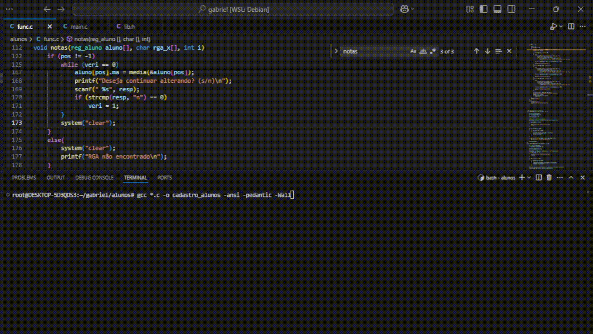

# 📚 Cadastro de Alunos

Este projeto simula um sistema de cadastro de alunos, desenvolvido para testar e aplicar os seguintes conceitos de programação em C:

- 🏷️ **Registros** (structs)
- 🔄 **Recursão**
- 🔗 **Ponteiros**

---

## ⚙️ Funcionalidades da Aplicação

✅ **Gerenciamento de Alunos**  
- Adicionar um novo aluno  
- Remover um aluno  

✅ **Atualização de Notas**  
- Editar as notas de um aluno  

✅ **Consulta de Alunos**  
- Exibir todos os alunos **aprovados** em **ordem alfabética**  
- Exibir todos os alunos **reprovados** em **ordem decrescente de nota**  
- Calcular e exibir a **média geral**, a **média dos aprovados** ou a **média dos reprovados**  

✅ **Encerramento**  
- Finalizar o programa  

---

## 📦 Bibliotecas Utilizadas

#include <stdio.h>   // Entrada e saída de dados

#include <stdlib.h>  // Alocação de memória e funções gerais

#include <string.h>  // Manipulação de strings

## Como compilar?

Coloque os três arquivos em uma pasta que contenha somente eles. Execute o seguinte comando no terminal:

    gcc *.c -o cadastro_alunos -ansi -pedantic -Wall

## Como executar?

No terminal, execute o comando:

    ./cadastro_alunos

## Executando o programa
